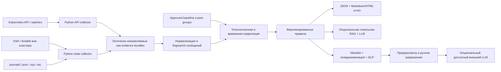

# Предпроектный анализ системы диагностики Kubernetes / РЕД ОС

Дата анализа: 2026-08-23

Статус: архитектурный анализ, без реализации

Исходные ограничения: Kubernetes 1.24, РЕД ОС 7.x, Python 3.8, Ansible 2.13

## 1. Краткий вывод

Систему с практической ценностью **можно построить без LLM** на Python 3.8 и Ansible 2.13. Она сможет:

- собирать состояние Kubernetes, узлов, kubelet, container runtime, CNI, systemd, ядра, cgroup, сети и защитного ПО;
- хранить историю изменений и инцидентные снимки;
- сравнивать узлы с утверждённым эталоном и друг с другом;
- выявлять известные сигнатуры, нарушения инвариантов и временные корреляции;
- выдавать понятное описание, доказательства, недостающие проверки и безопасный runbook.

LLM не нужна для сбора данных, проверки конфигураций и диагностики известных классов сбоев. Без LLM нельзя обещать только одно: универсально распознавать любую ранее неизвестную первопричину по произвольному шумному набору логов. Этого, впрочем, нельзя гарантировать и с LLM.

Рекомендуемое решение:

1. Сначала построить полностью работоспособное детерминированное ядро без LLM.
2. Позже, после измерений, добавить локальную модель только для поиска по доверенной базе знаний, группировки неизвестных сообщений и подготовки объяснения.
3. Внешний Google LLM рассматривать только как ручной fallback для минимизированной и псевдонимизированной выжимки и лишь при подтверждённой региональной/договорной доступности. Gemini Developer API / AI Studio на дату анализа недоступны из России.
4. Не давать ни локальной, ни внешней модели права выполнять команды или изменять кластер.

Итоговое архитектурное решение: **GO для rules-first системы без LLM; NO-GO для системы, в которой LLM является источником истины или механизмом автоматического исправления**.

## 2. Что означает ограничение «только Python 3.8 и Ansible 2.13»

Ограничение реалистично, если штатные интерфейсы и утилиты системы считаются источниками данных:

- Kubernetes API и уже установленный `kubectl`;
- `journalctl`, `systemctl`, `ip`, `ss`, `sysctl`, `rpm`/`dnf`;
- CRI-утилиты и API container runtime;
- `/proc`, `/sys`, `/etc`, systemd и journald.

В этом случае собственная логика может использовать только Ansible и стандартную библиотеку Python 3.8: `subprocess`, `json`, `sqlite3`, `gzip`, `hashlib`, `hmac`, `ssl`, `urllib`, `re` и т. п. Правила можно хранить в JSON, чтобы не добавлять YAML-парсер в Python-часть.

Есть два принципиально разных режима:

| Режим | Пригодность Ansible | Вывод |
|---|---:|---|
| Разовый аварийный снимок и инвентаризация | высокая | Ansible хорошо параллелит read-only проверки и забирает результаты |
| Периодический baseline с невысокой частотой | средняя | допустим Ansible или Python через systemd timer |
| Непрерывный watch Kubernetes и поток журналов | низкая | нужны постоянно работающие Python-сборщики; Ansible только развёртывает и настраивает их |

Если «только Python и Ansible» означает также запрет на отдельную БД, брокер и готовый log backend, то:

- инцидентный MVP и умеренный объём истории можно сделать на gzip/JSONL и SQLite;
- непрерывно хранить все логи всех Pod длительное время технически возможно, но это будет самостоятельная реализация части Loki/OpenSearch/Elastic со значительной стоимостью сопровождения;
- поэтому собирать все логи без ограничений не следует. Нужны лимиты, дедупликация, окна инцидента и политика для прикладных namespace.

Для локальной LLM буквальное ограничение уже не выполняется: современный inference требует нативного движка, CUDA/CPU-библиотек или отдельного serving runtime. При этом основная система может остаться клиентом на Python 3.8 и обращаться к изолированному LLM-сервису по HTTP.

### Если ограничение можно ослабить

Для production непрерывный транспорт и хранение логов проще и надёжнее не писать заново. Kubernetes прямо описывает node-level logging agent как типовую схему, а Node Problem Detector уже умеет читать journald/kmsg/systemd, выполнять custom health plugins и публиковать Node Conditions/Events/metrics. При наличии в организации Loki/OpenSearch/Elastic/Prometheus разумно использовать их как источники, оставив Python для нормализации, корреляции, rules engine и отчёта.

Эти компоненты не требуют LLM, но нарушают буквальное требование «только Python и Ansible». Поэтому архитектура должна зафиксировать, является ли это требование регуляторным запретом или лишь пожеланием сократить стек. Самописный log backend оправдан только в первом случае или для небольшого bounded MVP.

## 3. Существенные риски исходной платформы

Диагностическая система уменьшит время поиска причины, но не устранит риск устаревшей платформы.

- [Kubernetes 1.24](https://kubernetes.io/releases/1.24/) завершил поддержку 2023-07-28; финальный патч — 1.24.17. Ветка больше не получает обычные исправления и обновления безопасности.
- [`ansible-core` 2.13](https://docs.ansible.com/projects/ansible-core/2.13/reference_appendices/release_and_maintenance.html) завершил поддержку в ноябре 2023 года. Python 3.8 для control node был для него штатным, но сама ветка Ansible уже EOL.
- [Python 3.8](https://www.python.org/downloads/release/python-3820/) завершил поддержку 2024-10-07 и больше не получает исправления безопасности.
- По [актуальной информации РЕД ОС](https://redos.red-soft.ru/base/faq/faq-updates-ro73-to-ro8/) основная поддержка 7.3 завершается 2026-12-31. В период 2027–2028 годов ограниченная поддержка охватывает критические ошибки и security updates для пакетов установочного образа; доступная договорная поддержка зависит от уровня и даты приобретения сертификата.
- [РЕД ОС указывает](https://redos.red-soft.ru/base/update/support-kernels-version-in-redos/) для 7.3 полнофункциональную поддержку ядра 6.1; для 5.15 и 5.10 поддержка ограничена, причём последние обновления этих веток у вендора существенно старее.

Из этого следуют два независимых проекта:

1. Диагностический контур — можно начать на текущем стеке.
2. Обновление Kubernetes, Python/Ansible и выравнивание поддерживаемой матрицы РЕД ОС / kernel / runtime / CNI / Kaspersky — необходимо планировать отдельно.

Наличие системы диагностики не является компенсирующей мерой для отсутствующих security fixes.

## 4. Цели и границы системы

### Цели

- Получать доказательства даже при частичном отказе Kubernetes API.
- Видеть состояние до инцидента, изменение и последствия, а не только результат после перезагрузки.
- Находить конфигурационный drift между однородными узлами.
- Строить временную шкалу и топологические связи `Service -> EndpointSlice -> Pod -> Node -> kubelet/runtime/kernel`.
- Отличать первичный симптом от каскада вторичных ошибок.
- Формировать воспроизводимый вывод с указанием источника каждого факта.
- Безопасно готовить локальный и, при необходимости, внешний incident bundle.

### Не-цели первого этапа

- Не собирать бесконечно все прикладные логи без политики и лимитов.
- Не читать Kubernetes Secrets и приватные ключи.
- Не заменять Prometheus, SIEM или централизованный log backend во всех их функциях.
- Не выполнять автоматическое remediation.
- Не объявлять временную корреляцию доказанной причинностью.
- Не считать разницу версий ядра самостоятельной ошибкой.

## 5. Рекомендуемая архитектура

Сбор должен иметь два независимых пути. Если использовать только in-cluster DaemonSet, диагностический контур может исчезнуть вместе с кластером. Поэтому нужен вне-кластерный путь через SSH/Ansible и отдельный Kubernetes API collector.



Центральный сборщик и хранилище желательно размещать вне диагностируемого кластера. Node collector должен иметь ограниченный локальный spool и уметь продолжать сбор, когда центральный сервер или API временно недоступны.

Нужно различать развёртывание и диагностический запуск. Развёртывание создаёт service/unit, файлы программы и spool. Сам запуск сбора не изменяет operational configuration, workloads и состояние Kubernetes; его служебные записи ограничены, документированы, измеряемы и удаляются по retention policy.

### 5.1. Ansible orchestration

Ansible отвечает за:

- инвентаризацию и группы узлов по ролям;
- установку/обновление сборщиков;
- аварийный запуск только read-only диагностических проверок с таймаутами;
- параллельность и ограничение нагрузки;
- получение bundle с каждого доступного узла;
- явную фиксацию недоступных узлов и неуспешных проверок.

Ansible не должен долго выполнять `tail -f`, держать Kubernetes watch или быть транспортом для постоянного потока логов.

### 5.2. Python node collector

Требования к сборщику:

- команды только из жёсткого allowlist и с явными аргументами;
- отсутствие `shell=True`, `eval` и команд, поступивших из правила или LLM;
- timeout, код возврата, stdout/stderr, время начала/окончания и признак truncation для каждой проверки;
- продолжение работы при отказе отдельной команды;
- UTC-время, boot ID и сведения о синхронизации часов;
- ограничение CPU, RAM, IO, размера spool и объёма каждого источника;
- отсутствие изменений operational configuration, workloads и Kubernetes objects; разрешены только контролируемые записи собственного spool и metadata.

### 5.3. Kubernetes API collector

Сборщик делает первоначальный `LIST`, затем `WATCH` и корректно обрабатывает reconnect, `resourceVersion` и `410 Gone`. Это необходимо для истории изменений: Kubernetes Events по умолчанию имеют ограниченный TTL, а API watch также не является долговременным журналом.

Для непрерывного режима нужна явная семантика доставки:

- `at-least-once`, idempotency key и безопасная дедупликация повторов;
- транзакционная запись события и cursor/resourceVersion;
- после `410 Gone` — новый `LIST`, reconciliation текущего состояния и продолжение `WATCH`, без обещания восстановить уже потерянную историю;
- bounded spool, зарезервированный объём диска, backpressure и заранее утверждённая overflow policy с явным finding о потере данных;
- для первого bounded MVP — один writer с проверенной процедурой backup/restore; для HA позже нужны leader election и тестируемое recovery.

У collector должен быть отдельный ServiceAccount с минимальным RBAC. Доступ к `secrets` не выдаётся. Доступ к `pods/log` ограничивается нужными namespace и политикой сбора.

### 5.4. Хранилище доказательств

Для bounded MVP предварительно можно рассматривать:

- gzip-архивы исходных JSON/JSONL в append-only/WORM/object-lock либо строго ACL-хранилище;
- SQLite-индекс фактов, временной шкалы и ссылок как гипотезу до замера объёма и скорости;
- SHA-256 для обнаружения случайной порчи и подписанный либо HMAC-аутентифицированный manifest с ключом вне хранилища для аутентичности;
- раздельного хранения raw evidence, нормализованных фактов, findings и внешней выжимки.

Raw store содержит наиболее чувствительные данные системы. Обязательны encryption at rest, минимальные ACL, аудит доступа, резервное копирование, тест восстановления и формальная retention/deletion policy. SHA-256 без trust anchor не мешает злоумышленнику заменить bundle и пересчитать manifest.

Минимальные метаданные каждой записи:

```text
collection_id, schema_version, source_id, cluster_id,
node_uid, boot_id, observed_at_utc, collected_at_utc,
command_or_api, exit_status, truncated, sensitivity,
payload_hash, raw_evidence_ref
```

Raw evidence логически не переписывается результатом нормализации. Анализ должен быть повторяемым на одном и том же bundle. Пригодность SQLite подтверждается только после sizing: количество Node/Pod, log rate, incident window, retention, максимальный bundle, время ingest и допустимое время отчёта. При превышении утверждённых границ нужен внешний backend.

### 5.5. Нормализация и корреляция

Нормализованные сущности:

- Cluster, Node, Boot, Kernel, OS;
- Pod, Container, Probe, Workload, Service, Endpoint;
- kubelet, Runtime, CNI, kube-proxy;
- NetworkInterface, Route, Listener, Sysctl;
- CgroupHierarchy, Controller, SystemdUnit;
- SecurityAgent, PackageTransaction, ConfigChange.

Логи сначала переводятся в шаблоны: переменные IP, UID, PID, timestamp и имена объектов отделяются от постоянной части сообщения. Для шаблона хранятся count, first/last seen, источники и примеры. Это резко уменьшает объём и не требует LLM.

Корреляция выполняется по четырём измерениям:

1. Время: что изменилось перед началом ошибок.
2. Область: весь кластер, одна роль узлов, одна версия ядра или один узел.
3. Топология: какой Pod, Node, runtime и endpoint связаны.
4. Контраст: чем неисправные узлы отличаются от одновременно здоровых.

### 5.6. Угрозы основному контуру

LLM не является единственным риском. Сам сборщик получает чувствительные полномочия и создаёт центральное хранилище:

| Риск | Минимальная защита |
|---|---|
| Кража SSH credentials или kubeconfig | отдельные identities, least privilege, hardware/secure secret storage, rotation, запрет общего admin kubeconfig |
| MITM при SSH/API/ingest | строгая host-key/CA verification, TLS/mTLS, запрет trust-on-first-use в production |
| Чрезмерный sudo | фиксированный allowlist команд/путей, отсутствие shell и параметров от пользователя/LLM, audit |
| Компрометация collector | подписанный/pinned артефакт, минимальные права, egress allowlist, обновления и rollback |
| Утечка central raw store | encryption, ACL, operator audit, retention/deletion, offline backup key separation |
| Подмена evidence | append-only/WORM, authenticated manifest, отдельный trust key и проверка при replay |
| Отказ/переполнение | bounded spool, reserved disk, backpressure, health metrics и протестированное recovery |

## 6. Какие данные собирать

Сбор должен быть allowlist-ориентированным. «Собрать всё» одновременно создаёт лишнюю нагрузку, ухудшает поиск причины и повышает риск утечки.

### 6.1. Kubernetes

| Источник | Что важно |
|---|---|
| Nodes | conditions, taints, addresses, capacity/allocatable, kernel/OS/kubelet/runtime versions, lease/heartbeat |
| Pods | nodeName, phase, Pod IP/IPs, probes, container states, restart count, termination reason, readiness conditions |
| Events | type, reason, reporting component, involved object UID, count/series, first/last observed time, message |
| Workloads | Deployment/StatefulSet/DaemonSet/Job status, desired/available replicas, rollout state |
| Services и EndpointSlices | selectors, IP family, endpoints, readiness, соответствие Pod |
| Scheduling/storage | taints/tolerations, PDB, PVC/PV/CSI, scheduling failures |
| kube-system | состояние и bounded logs CNI, kube-proxy, CoreDNS, control-plane компонентов |
| API/control plane | readiness/health, audit metadata при наличии, static pod manifest hashes, certificate metadata |
| etcd | member/endpoint health, quorum/leader/peer state, alarms, DB size, request/fsync latency, disk symptoms, certificate metadata и logs; без содержимого БД |

[Kubernetes Events](https://kubernetes.io/docs/reference/command-line-tools-reference/kube-apiserver/) нельзя считать полноценной историей инцидентов: default `--event-ttl=1h0m0s`, но параметр изменяем. Нужно собирать его effective значение из реального kube-apiserver config; непрерывный collector важнее постфактум команды `kubectl get events`.

Для CNI нужны version-specific adapters. Общего чтения `/etc/cni/net.d` недостаточно: в зависимости от Calico/Cilium/Flannel и используемого IPAM/BGP следует собирать собственные status, routes/maps/peers и логи по утверждённой схеме.

### 6.2. Каждый узел РЕД ОС

| Область | Что важно |
|---|---|
| ОС и загрузка | точный release/minor, `uname -r`, установленные kernel packages, `/proc/cmdline`, boot ID, `journalctl --list-boots`, uptime |
| Изменения | RPM/`dnf` history, версии и время установки пакетов, mtimes/hashes конфигурации, reboot timeline |
| systemd | effective units/drop-ins, состояние и effective command line kubelet/runtime/Kaspersky |
| kubelet/runtime | конфигурация и флаги без credentials, версии, CRI endpoint, cgroup driver, status, journal |
| CNI/kube-proxy | тип и версия, конфигурация без секретов, hashes binaries, режим kube-proxy, журналы |
| Сеть | `ip -j addr/route/rule/link`, MTU, listeners, resolv.conf, DNS-проверки, firewall/nftables/iptables, conntrack stats |
| sysctl | effective value, ordered candidate config files, конфликтующие определения, NetworkManager profiles и расхождение runtime/file state; provenance только при наличии audit/change history |
| Ресурсы | disk/inode, read-only FS, memory/CPU/PID pressure, PSI, OOM, load, FD limits |
| Security | SELinux/AVC, audit, firewalld, версия/режим/состояние/logs/modules Kaspersky |
| Время | chrony/NTP state, offset/clock skew |
| Сертификаты | subject, issuer, SAN, serial, fingerprint, expiry, key/signature algorithm, KU/EKU и chain metadata; никогда private key; SAN/DNS/IP считаются sensitive |

Нужно фиксировать загруженное ядро отдельно от последнего установленного: после обновления пакета узел может продолжать работать на старом ядре.

Для инцидента, завершившегося reboot, текущего журнала недостаточно. Collector должен ограниченно забирать journal текущей и предыдущей загрузки по `_BOOT_ID`, фиксировать, включено ли persistent-хранение journald, его retention/vacuum и доступные boots, а также наличие `kmsg`, pstore и kdump/vmcore metadata. Если persistent journal, pstore или kdump заранее не настроены, причинные сообщения до перезагрузки могут быть невосстановимо потеряны; диагностическая система должна явно сообщать об этом пробеле, а не достраивать причину.

### 6.3. Cgroup

Недостаточно записать только `v1` или `v2`. Нужны:

- filesystem type и mountinfo для `/sys/fs/cgroup`;
- `/proc/cgroups`, `/proc/<PID>/cgroup` и process-specific `/proc/<PID>/mountinfo`/mount namespace для kubelet, runtime и Kaspersky;
- `cgroup.controllers`, `cgroup.subtree_control`, `cgroup.procs` и реально доступные `cpu`, `io`, `memory`, `pids` от root по ancestors нужного service; `cgroup.type` — только для non-root cgroups, а при `threaded` также `cgroup.threads`;
- owner/mode, ACL и SELinux context целевого cgroup path и его ancestors, UID/GID/capabilities процесса, получившего отказ;
- systemd version и свойства `ControlGroup`, `Delegate`, `Slice` для units;
- для kubelet, runtime и защитного агента — effective unit sandboxing, включая `ProtectControlGroups`, `ReadOnlyPaths`, `InaccessiblePaths`, `PrivateMounts`, и их фактический mount namespace;
- cgroup driver kubelet и runtime;
- runtime и OCI runtime versions;
- kernel command line, relevant kernel config, включая `CONFIG_RT_GROUP_SCHED`, и scheduler policy/rtprio процессов;
- BPF/LSM attachment state и связанные audit events;
- точные errno/messages при создании cgroup или записи controller;
- версия и события защитного агента в том же временном окне.

### 6.4. Pod logs

Рекомендуемая политика:

1. Для всех Pod — metadata, статус, Events и короткие error windows с жёстким лимитом.
2. Для `kube-system` и control plane — более полная, но всё равно bounded история.
3. Для прикладных namespace — opt-in/allowlist, поскольку логи могут содержать персональные данные, SQL, токены и тела запросов.
4. Собирать current и `previous` container log там, где был restart, пока он ещё доступен.

Kubernetes хранит по умолчанию только лог одного завершённого экземпляра контейнера, а при удалении Pod локальные логи могут исчезнуть. Следовательно, постоянная bounded история важнее LLM и разового снимка после сбоя.

## 7. Детерминированный диагностический движок

### 7.1. Контракт правила

Каждое правило должно содержать:

- стабильный ID и версию;
- применимые версии Kubernetes, ОС, kernel, runtime, CNI и security agent;
- обязательные и дополнительные источники;
- predicates `all` / `any` / `not`, временное окно и группировку;
- исключающие условия и контрдоказательства;
- severity, `finding_status` и отдельную `causal_confidence`;
- шаблон объяснения;
- read-only проверки для подтверждения;
- безопасную рекомендацию, риск, предусловия и rollback;
- ссылки на официальную документацию и внутренний runbook;
- positive и negative test fixtures.

Нельзя смешивать факт аномалии и её причинную роль. `finding_status=confirmed` означает, что нарушение инварианта непосредственно наблюдается; это ещё не подтверждает, что оно вызвало каскад. Для причинности не следует использовать придуманный процент вида «95%». Полезнее отдельная `causal_confidence`:

- **подтверждено** — есть прямая механистическая трасса либо контролируемое воспроизведение/устранение при неизменных существенных условиях;
- **вероятно** — совпадают механизм, время, область воздействия и известная сигнатура;
- **возможно** — есть часть признаков, но существуют альтернативы;
- **недостаточно данных** — система перечисляет, чего именно не хватает.

### 7.2. Содержание finding

Каждый вывод должен отвечать на вопросы:

```text
Что наблюдается?
На какие объекты и период это влияет?
Какие evidence ID подтверждают вывод?
Какие есть контрдоказательства и альтернативы?
Каких данных не хватает?
Какие read-only проверки выполнить?
Какой способ исправления применим и при каких условиях?
Каков риск изменения и как откатить его?
На какие версии и источники опирается рекомендация?
```

Это обеспечивает более высокий уровень аудируемости, чем свободный ответ LLM.

### 7.3. Базовый набор классов правил

- Node NotReady, потеря lease/heartbeat и kubelet startup loop;
- taxonomy readiness/liveness/startup probe failures;
- IPv4/IPv6, CNI, routes, MTU, DNS и kube-proxy;
- cgroup v1/v2, controllers, driver mismatch и systemd delegation;
- container runtime/CRI и image pull;
- disk/inode/PID/memory pressure, PSI и OOM;
- certificate expiry и clock skew;
- conntrack saturation, firewall и SELinux deny;
- scheduling, taints, PDB, storage/CSI;
- drift kernel, sysctl, package, CNI/runtime и security agent;
- изменение конфигурации непосредственно перед каскадом ошибок.

## 8. Разбор описанных инцидентов

### 8.1. Отключение IPv6 и массовые readiness failures

По имеющемуся описанию связь очень вероятна, но точный механизм постфактум не доказан. Readiness failure — симптом; первопричина зависит от точного endpoint и текста ошибки.

[Документация ядра Linux](https://docs.kernel.org/networking/ip-sysctl.html#proc-sys-net-ipv6-variables) указывает, что переключение `net.ipv6.conf.<iface>.disable_ipv6` с 0 на 1 удаляет IPv6-адреса и маршруты на выбранном интерфейсе. [Kernel/module option `ipv6.disable=1`](https://www.kernel.org/doc/html/v5.19/networking/ipv6.html) действует ещё жёстче: AF_INET6 socket открыть нельзя. Запись `conf/all/disable_ipv6` распространяет значение на `default` и текущие интерфейсы, но чтение `all` не является агрегированным состоянием и не имеет полезной однозначной семантики. Проверять нужно `default` и каждый relevant interface, а при наличии доступа — также затронутые network namespaces, поскольку `/proc/sys/net` namespaced.

HTTP/TCP probe выполняет kubelet из network namespace узла и по умолчанию обращается напрямую к Pod IP, не через Service. Поэтому прямой механизм возможен, если:

- Pod IP или явно заданный host probe был IPv6;
- явно заданный hostname в `probe.host` разрешился node-side resolver в IPv6; default probe использует Pod IP без DNS;
- kernel/module option запретил AF_INET6 socket либо sysctl удалил конкретный IPv6 address, к которому процесс привязывался, что подтверждено bind errno/application log;
- CNI, DNS или другой сетевой компонент использовал IPv6 независимо от того, считался ли кластер прикладно IPv4-only.

Но правило `IPv6 disabled => root cause` будет неверным. В исправном IPv4-only кластере этот sysctl может не ломать probes. Система должна проверить:

- `net.ipv6.conf.all/default/lo/<iface>.disable_ipv6` и kernel argument `ipv6.disable=1`;
- Pod/Service/Node address families, cluster/service CIDR и CNI mode;
- фактический Pod IP и `host` конкретной probe;
- listener приложения и маршруты;
- effective values, ordered candidate configs, NetworkManager/CNI/systemd definitions и audit/change timeline; точный source указывается только при доказанной provenance, иначе `unknown/runtime`;
- точный класс ошибки kubelet: timeout, connection refused, no route, address family not supported, DNS, TLS, HTTP 4xx/5xx или exec non-zero;
- различия между одновременно здоровыми и неисправными узлами.

Тип probe принципиален. При `exec` probe команда выполняется внутри контейнера, поэтому прямой сетевой путь `node -> Pod IP` не участвует. Для IPv4 Pod IP HTTP/TCP probe обычно также обходит Service VIP, kube-proxy и CoreDNS; тогда приоритет проверки — CNI path с узла до Pod, route, listener и ресурсы приложения.

Уверенность становится высокой, когда одновременно выполнены условия:

```text
изменение effective sysctl
  -> исчезновение IPv6 address/route или невозможность socket/probe
  -> ошибки на связанных Pod/Node
  -> отсутствие более простого объяснения
  -> восстановление после возврата known-good настройки
```

Последовательная перезагрузка является полезной частью timeline, но не доказывает механизм сама по себе: reboot также пересоздаёт network namespaces, sockets, CNI state и systemd services.

Безопасная рекомендация rule engine — вернуть утверждённый baseline через change procedure, проверить один drained-узел, затем выполнять последовательное обслуживание с контролем здоровья. До drain необходимо проверить spare capacity и PDB, а для control-plane узла — также quorum etcd и доступность остальных control-plane компонентов. Автоматически менять sysctl и перезагружать узлы система не должна.

### 8.2. Новое ядро, Kaspersky и cgroup v2

По [KEP-2254](https://github.com/kubernetes/enhancements/blob/master/keps/sig-node/2254-cgroup-v2/kep.yaml) в Kubernetes 1.24 поддержка cgroup v2 имела статус beta (beta с 1.22); [stable/GA — с Kubernetes 1.25](https://kubernetes.io/blog/2022/08/31/cgroupv2-ga-1-25/). Version-specific документация Kubernetes 1.24 задаёт upstream minimum: kernel 5.8+, containerd 1.4+ либо CRI-O 1.20+ и `systemd` cgroup driver у kubelet и runtime. Это только нижняя граница upstream: backports дистрибутива и фактическая матрица РЕД ОС/CNI/runtime/Kaspersky всё равно должны быть проверены для точных сборок.

Диагностическая цепочка для описанного случая:

1. После kernel/package transaction kubelet не стартует или циклически падает.
2. В kubelet/runtime есть конкретные ошибки создания/делегирования cgroup или доступа к `cpu`/`io`.
3. Узел действительно загружен в cgroup v2 mode.
4. Требуемые controllers отсутствуют, не включаются либо запись завершается отказом.
5. Конфигурации kubelet/runtime/systemd сами по себе согласованы.
6. Версия конкретного продукта Kaspersky не соответствует утверждённой локальной compatibility matrix либо в его логах/audit есть прямой block/deny.
7. Обновление Kaspersky устраняет проблему на тестовом узле.

Отсутствующий или не включённый controller считается причинным только тогда, когда реальная конфигурация kubelet/runtime/systemd требует его, а fatal path и точный errno ссылаются на него. Иначе это config/compatibility drift, но не доказанная причина остановки kubelet.

До наличия прямого vendor event или подтверждённой compatibility rule корректная формулировка — «вероятное вмешательство security agent», а не безусловное «Kaspersky заблокировал cgroup».

Система должна различать как минимум четыре механизма:

1. `cpu` или `blkio` attached/bound к legacy cgroup v1 hierarchy, поэтому соответствующие `cpu`/`io` отсутствуют в unified v2. Связь с Kaspersky требует process mount namespace, timeline, vendor event либо воспроизведения; наличие v1 mount само по себе её не доказывает.
2. Сторонний процесс управляет hierarchy вне делегированного systemd subtree. Single-writer — архитектурное правило systemd, а не kernel-enforced invariant; причинность требует наблюдавшейся записи, перемещения PID или изменения controller и совпадающей ошибки kubelet/runtime.
3. Запись kubelet/runtime в `cgroup.subtree_control`, `cpu.*` или `io.*` получает точный `EACCES`, `EPERM` или `EROFS`. Перед атрибуцией нужно сопоставить path/errno с DAC/ACL, SELinux/другим LSM, systemd sandboxing и mount namespace; блокировка Kaspersky подтверждается только совпадающим vendor/audit deny либо контролируемым воспроизведением.
4. При `CONFIG_RT_GROUP_SCHED=y` CPU controller может не включиться, пока realtime-процессы находятся в non-root cgroups; попытка обычно даёт `EINVAL`. Нужно сопоставить scheduler policy/rtprio и PID с cgroup. Этот механизм не объясняет отсутствие `io`.

Обязательно исключить альтернативы:

- mismatch `systemd` / `cgroupfs`;
- изменение cgroup mode параметрами загрузки;
- неподдерживаемый container/OCI runtime;
- ошибка systemd delegation или hardening (`ProtectControlGroups`, read-only/inaccessible paths, private mount namespace);
- DAC/ACL или SELinux/другой LSM;
- controller не собран или отключён в kernel;
- повреждённая/неправильно смонтированная hierarchy.

Сильное доказательство первого механизма: controller присутствует в kernel `/proc/cgroups`, отсутствует в cgroup v2 и attached к legacy v1 hierarchy. Связь с агентом требует дополнительно process-specific mount namespace, timeline/vendor event или canary reproduction. Сильное доказательство прямой блокировки: точные path и errno операции плюс совпадающий vendor/audit deny. Одного сообщения `controller not found` для обвинения Kaspersky недостаточно.

Точный продукт и версия Kaspersky существенны: Endpoint Security, Container Security и иные агенты имеют разные механизмы и матрицы поддержки. Нужно сохранять полную RPM NEVRA, режим, policy version, loaded modules/eBPF state и vendor logs.

Рекомендация: сверить version-specific официальную матрицу и собрать vendor bundle. Обновлять или перенастраивать агент следует только при подтверждённой несовместимости, прямом deny либо canary reproduction и по vendor runbook; иначе нужна эскалация вендору. Любое изменение испытывается на одном drained-узле с rollback, но только после проверки spare capacity, PDB и, для control-plane, quorum etcd/control-plane. Нельзя автоматически отключать антивирус, переводить cgroup mode или менять cgroup driver работающего узла.

### 8.3. Разные версии ядра

Разница ядра 5.x и 6.x — drift и фактор риска, но не готовый диагноз. Сравнивать следует однородные группы узлов по роли и аппаратной платформе.

Finding повышается по severity, если неисправность статистически и механистически локализована на конкретной комбинации:

```text
RED OS minor + booted kernel + cgroup mode + runtime + CNI
+ kubelet cgroup driver + Kaspersky version/policy
```

Утверждение «выровнять ядра» допустимо только после проверки поддержки у РЕД ОС, Kubernetes/runtime/CNI и Kaspersky. [Вендор РЕД ОС](https://redos.red-soft.ru/base/update/support-kernels-version-in-redos/) сейчас считает 6.1 полнофункционально поддерживаемой веткой для 7.3, но миграцию всё равно следует проверять на стенде и выполнять по одному drained-узлу после проверки spare capacity, PDB и, для control-plane, quorum etcd/control-plane.

## 9. Что даёт LLM и чего она не исправляет

| Возможность | Без LLM | Локальная LLM + RAG | Внешний Gemini |
|---|---:|---:|---:|
| Инвентаризация и exact config drift | отлично | не нужна | не нужна |
| Проверка известных инвариантов | отлично | не нужна | не нужна |
| Временная/топологическая корреляция | хорошо при наличии истории | может пересказать | может пересказать |
| Версионированный безопасный runbook | отлично из правил | может переформулировать | может переформулировать |
| Дедупликация логов | хорошо шаблонами/regex | помогает в сложных случаях | помогает |
| Fuzzy/semantic match ошибки с KB | хорошо через FTS/BM25/символьную близость | может переранжировать и объяснить найденное | только после безопасного экспорта |
| Гипотезы для нового класса сбоя | ограниченно | полезна, но ошибается | качество не предполагается выше и проверяется тем же gold set |
| Доказательство причинности | нет гарантии | нет гарантии | нет гарантии |
| Конфиденциальность | зависит от allowlist, RBAC, хранения и retention | дополнительно зависит от изоляции inference и prompt logging | дополнительно зависит от провайдера, региона и export gateway |
| Повторяемость | высокая при authenticated bundle и pinned rules | требует pin model digest, quantization, prompt, decoder, runtime и KB | точный replay не гарантирован при изменении provider model |

Наибольший эффект дают не параметры модели, а качественная история, baseline, topology и версионированная база знаний.

## 10. Локальные open-source / open-weight модели

Локальные модели подходят как необязательный слой для:

- краткого объяснения findings по-русски;
- объяснения и семантического переранжирования кандидатов, уже найденных exact/FTS/BM25 retrieval;
- группировки ранее неизвестных сообщений;
- предложения ID дополнительных read-only проверок из утверждённого каталога;
- ответа на вопросы оператора по уже собранным evidence.

Они не должны самостоятельно определять окончательную причину, генерировать исполняемые команды или иметь cluster credentials.

Локальность модели не делает raw evidence безопасным. Input builder передаёт только минимальные sensitivity-labelled excerpts; inference service не получает прямого доступа к evidence storage, filesystem или Kubernetes API.

Термины `open-source` и `open-weight` не всегда совпадают. Перед использованием нужно проверить лицензию весов, кода serving и право коммерческого/закрытого применения.

В качестве первого измеряемого baseline для русского технического текста разумно сравнить:

- Qwen3 8B и 14B: Apache 2.0, русский входит в заявленные 119 языков;
- Qwen3.5-9B: Apache 2.0, 9B parameters и заявленные 201 язык — только challenger, поскольку его текущая model card требует самый новый/nightly serving stack;
- одну альтернативную multilingual instruct-модель сопоставимого размера.

Выбирать модель по общему leaderboard нельзя. Нужен закрытый benchmark на собственных минимизированных и псевдонимизированных инцидентах РЕД ОС, Kubernetes 1.24, CNI/CRI и Kaspersky. Квантизация, размер context и качество русского измеряются отдельно.

Пригодность зависит от пока неизвестного железа. Нижняя оценка памяти только для весов равна `parameters × bits / 8`: для 8B это около 16 GB в BF16 или 4 GB в Q4 до KV cache, runtime buffers и batching. До benchmark необходимо зафиксировать CPU ISA, RAM, GPU/VRAM, driver/runtime, целевой context, latency, throughput и энергопотребление. Эти модели и `llama.cpp` — кандидаты для измерения, не заранее выбранное решение.

Архитектура локального слоя:

```text
rules/findings + evidence IDs
        +
локальная доверенная KB (official docs + internal runbooks)
        -> retrieval (сначала exact/FTS, затем embeddings при необходимости)
        -> локальная LLM без tools и без Internet
        -> структурированный ответ с evidence/source IDs или abstain
```

Fine-tuning не нужен на первом этапе. RAG позволяет обновлять factual KB без включения этих знаний в веса модели и уменьшает потребность в fine-tuning, но incident excerpts в prompts, caches и inference logs всё равно остаются чувствительными данными. Документы в KB должны иметь URL, дату снимка, применимые версии и checksum; содержимое Pod logs никогда автоматически не становится инструкцией или частью KB.

По состоянию на дату анализа актуальный vLLM поддерживает Python 3.10–3.13, поэтому его нельзя устанавливать в environment основной системы с Python 3.8. Практичны два варианта:

- отдельная VM/контейнер с актуальным runtime и GPU serving;
- `llama.cpp`/аналогичный нативный HTTP server для quantized модели.

Предпочтительно размещать inference вне диагностируемого кластера. Если это невозможно, допустимы только выделенные tainted nodes с жёсткими quotas, priority и network isolation, но они всё равно остаются в общей failure domain.

### Контракт ответа модели

```json
{
  "claims": [
    {
      "text": "...",
      "supporting_evidence_ids": ["..."],
      "contradicting_evidence_ids": ["..."],
      "source_chunk_ids": ["..."]
    }
  ],
  "missing_check_ids": ["catalog.check_id"],
  "candidate_runbook_ids": ["catalog.runbook_id"],
  "operator_questions": ["..."],
  "version_scope": ["..."],
  "abstain_reason": null
}
```

Приложение валидирует JSON Schema с политикой fail closed и проверяет существование evidence, source chunk, check и runbook ID. Существование ссылки не доказывает, что источник подтверждает claim, поэтому UI показывает оператору соответствующий evidence и source fragment. Check/runbook ID разрешаются только через локальный проверенный каталог; свободный текст модели никогда не становится командой. Число confidence модели не принимается как вероятность. При недостатке данных правильный ответ — `abstain`.

## 11. Внешняя выжимка для Google Gemini

Такой вариант возможен, но артефакт корректнее называть **минимизированным и псевдонимизированным**, а не гарантированно анонимным. Редкая комбинация версий, топологии и времени может идентифицировать организацию даже после удаления hostname.

Псевдонимизированный bundle и ответ внешней модели сохраняют классификацию `confidential`: к ним применяются access control, encryption, audit и retention исходных диагностических данных. Остаточный риск утечки и re-identification нельзя свести к нулю автоматическими regex/DLP-проверками.

### 11.1. Конвейер экспорта

1. Парсинг Kubernetes JSON и системных результатов по схеме.
2. Проекция только разрешённых полей; не редактирование полного raw bundle.
3. Удаление запрещённых классов данных.
4. Детекторы JWT, PEM, credentials, URL, IP, email, base64/high-entropy строк.
5. Стабильные в пределах инцидента токены через HMAC-SHA-256 с отдельным случайным ключом инцидента.
6. Дедупликация и шаблонизация логов.
7. Повторный outbound DLP scan с политикой fail closed.
8. Формирование redaction report и preview.
9. Явное подтверждение человеком.
10. Stateless API-вызов; полученный ответ сохраняется как недоверенная гипотеза.

Redaction report и preview не содержат исходных значений: только detector type, count и локальную evidence reference.

Для incident-local токенов используется отдельный случайный 256-bit key. Он хранится отдельно и уничтожается по retention policy, если повторное связывание не требуется. Обычный SHA-256 от hostname не подходит из-за перебора. HMAC защищает заменённые direct identifiers, но не анонимизирует topology, quasi-identifiers или редкий version fingerprint; компрометация key раскрывает связанные токены.

### 11.2. Что допустимо оставить

- диагностически необходимые версии Kubernetes, kernel, runtime, CNI и security agent только после оценки fingerprinting risk; ненужные patch/build значения обобщаются;
- роль узла и архитектуру;
- только утверждённые значения sysctl/cgroup/runtime из allowlist;
- нормализованный шаблон ошибки, count и источник;
- относительное или округлённое время;
- связи через `NODE_01`, `POD_03`, `ADDR_02` и другие incident-local токены;
- findings rules engine, evidence IDs, контрдоказательства и конкретный вопрос модели.

### 11.3. Что запрещено отправлять

- Kubernetes `Secret.data`/`stringData`, ServiceAccount JWT и kubeconfig;
- private keys, credentials и connection strings;
- environment values и ConfigMap data по умолчанию;
- полные манифесты и сырые логи;
- реальные hostname, DNS, IP, MAC, namespace, Pod, Service, user/customer names;
- private registry/repository URLs;
- request/response body, SQL и audit payload;
- произвольные labels, annotations и command line без разбора;
- реальные cluster/resource UID, cloud project/account ID, trace/span ID и внутренние ticket ID;
- certificate/CSR body, subject/SAN, serial и fingerprint без отдельной диагностической необходимости;
- proxy/`no_proxy`, host paths, `/proc/*/environ`, systemd `Environment` и неразобранный CRI inspect output;
- evidence/source ID, если он кодирует hostname, namespace, UID или иной исходный идентификатор.

### 11.4. Условия использования внешнего Google LLM

Сначала необходимо зафиксировать конкретный продукт: Gemini Developer API / Google AI Studio либо Gemini Enterprise Agent Platform / Google Cloud. Их договорные условия, региональность, retention и механизмы ZDR не взаимозаменяемы.

Для Gemini Developer API / AI Studio:

- Google различает Unpaid и Paid Services по billing/Workspace-контексту, а не просто по UI;
- в Unpaid Services входы и выходы могут использоваться для улучшения продуктов и обрабатываться human reviewers; отправлять туда sensitive/confidential/personal information нельзя;
- в Paid Services prompts/responses не используются для улучшения продуктов и обрабатываются по DPA, но [текущая abuse-monitoring policy](https://ai.google.dev/gemini-api/docs/usage-policies) предусматривает хранение prompt, context и output 55 дней; flagged data может попасть на review авторизованному персоналу;
- ZDR действует только после одобрения конкретного project; developer-owned API logging, datasets, feedback и data sharing являются отдельными механизмами и должны быть выключены;
- `store=false` относится к Interactions API. Для обычного `generateContent` используется stateless request без несуществующего параметра `store`;
- Search/Maps grounding, File API, explicit cache, Live session resumption и stateful API имеют отдельные retention rules;
- Paid Services сами по себе не дают общей гарантии data residency.

По состоянию на 2026-08-23 Россия отсутствует в [официальном списке доступных регионов](https://ai.google.dev/gemini-api/docs/available-regions) Gemini Developer API / AI Studio, а [Terms](https://ai.google.dev/gemini-api/terms) разрешают доступ только из available region. Поэтому этот продукт нельзя считать доступным production-маршрутом для системы, эксплуатируемой из России. Обход региональных ограничений не рассматривается. Доступность Google Cloud / Gemini Enterprise Agent Platform проверяется отдельно договорным и техническим путём.

Для Gemini Enterprise Agent Platform / Google Cloud отдельно проверяются конкретные model, feature и region, Cloud DPA, data residency, IAM, request/response logging, abuse monitoring и возможность ZDR. Некоторые advanced features могут быть несовместимы с полным ZDR.

Production GO возможен только после проверки доступности и договора: DPA, утверждённый region, документированный retention, требуемый ZDR/исключение abuse logging, отключённые request/response logs и data sharing, отсутствие grounding/File/cache/stateful features, least-privilege identity, TLS egress gateway, quotas и audit metadata без содержимого prompt. Условия перепроверяются непосредственно перед вводом.

## 12. Модель угроз для LLM-контура

| Угроза | Пример | Защита |
|---|---|---|
| Indirect prompt injection | Pod пишет в лог «игнорируй инструкции» | логи явно размечены как недоверенные данные, control characters нормализуются; отсутствие tools/web только ограничивает blast radius; claims требуют evidence и rule/human review |
| Утечка | token оказался в stack trace | field allowlist, DLP, fail closed, ручной preview |
| Poisoning KB | подменён runbook | только доверенные источники, pin версии, checksum, review |
| Hallucination | вывод относится к другой версии | evidence/source fragments, version scope, только catalog check/runbook IDs, no auto-remediation |
| Supply chain | подменённые weights, tokenizer, template или serving image | verified vendor, pinned revision/digest, internal mirror, SBOM/signature где доступны; SafeTensors/GGUF лишь снижают loader risk; запрет `trust_remote_code`, egress deny и изоляция |
| DoS | гигантский лог заполняет context/GPU | лимиты, templates, sampling, rate limit, отдельный inference host |
| Cross-incident leak | cache/vector index/logging смешал кластеры | tenant/incident-scoped index и cache keys, запрет prompt-content logging, retention и ACL |
| Provider/region retention | sanitized prompt хранится вне разрешённого региона | product-specific Terms/DPA, availability check, ZDR, отключение logs/data sharing и документированный region |
| Inference endpoint exposure | посторонний читает evidence через локальный API | bind private/loopback, mTLS/auth proxy, least privilege, rate limit, audit metadata без prompt |
| Silent model drift | provider/model/runtime обновился без revalidation | pin model digest, prompt/schema/KB/decoder/runtime versions и regression gate |
| Re-identification | редкий version/topology fingerprint | минимизация, incident-local HMAC, generalization и ручная оценка |
| Unsafe output | UI исполняет Markdown, remote image или command | schema validation, HTML escaping, raw Markdown/remote content disabled, CSP, только catalog check/runbook IDs |

System prompt, delimiter и prompt-injection classifier не дают гарантированной защиты. Архитектура исходит из того, что модель может быть успешно манипулирована: её output недоверенный, не имеет side effects и проходит adversarial tests с direct/indirect injection, encoded/split secrets и malicious Markdown.

## 13. Этапы реализации

### Этап 0. Спецификация и данные

- точные РЕД ОС minor, kernel, CNI, runtime, способ установки Kubernetes;
- точный продукт/версия/режим Kaspersky;
- topology и node peer groups;
- число Node/Pod, log rate, incident window, retention, max bundle, ingest/report SLO и границы применения SQLite;
- источники, доступ, retention, классификация данных и допустимое окно потери;
- процесс ручного утверждения, версия, срок действия и owner approved baseline/compatibility matrix; baseline не переобучается во время инцидента;
- сохранённые материалы двух известных инцидентов, если они ещё существуют; иначе synthetic mechanism fixtures и план controlled lab reproduction;
- CPU ISA, RAM, GPU/VRAM, driver/runtime, latency/throughput/context budget для локальной модели;
- доступность внешнего провайдера по региону и договору;
- критерии приёмки.

### Этап 1. Incident snapshot без изменения operational state, без LLM

- Ansible orchestration;
- node и Kubernetes API collectors;
- bounded journal/log window;
- логически append-only bundles, authenticated manifest и checksums;
- inventory, peer drift и статический JSON/Markdown отчёт;
- частичный отчёт при недоступности API или части узлов.

### Этап 2. Первый rule pack

- kubelet/Node NotReady;
- probe error taxonomy;
- IPv6/sysctl/CNI;
- cgroup/controllers/driver/runtime;
- disk/inode/PID/memory/OOM;
- DNS, firewall, conntrack;
- certificate/time skew;
- kernel/security-agent correlations.

### Этап 3. История и baseline

- Python/systemd collectors и journal cursors;
- Kubernetes LIST/WATCH с reconnect;
- at-least-once ingest, idempotency/deduplication, bounded spool, backpressure и overflow finding;
- timeline package/config/reboot changes;
- retention и alerting.

### Этап 4. Опциональный AI-контур

- сначала exact/SQLite FTS по локальной KB;
- затем benchmark локальной модели и RAG;
- только после этого sanitized export gateway и доступный по региону/договору внешний fallback.

Автоматическое remediation не следует включать ни в один из этих этапов до отдельной формальной оценки риска.

## 14. Проверка качества

### Детерминированная часть

- unit/golden tests на реальные и синтетические outputs;
- positive и negative fixtures для каждого правила;
- malformed, truncated, missing data, Unicode/locale, clock skew и reboot boundaries;
- replay одного bundle даёт один и тот же результат;
- каждый finding имеет evidence;
- недоступность одного collector не уничтожает весь отчёт.

Отдельные fault/recovery и load tests:

- заполнение spool и overflow policy;
- повреждённый bundle/manifest/SQLite и восстановление backup;
- дубликаты WATCH, `410 Gone`, RBAC denial, journal rotation/vacuum;
- отказ central writer, API и SSH по отдельности;
- измерение wall time, CPU/RAM/IO, API QPS, bundle size, окна потери и времени построения отчёта.

Обязательные контрпримеры:

- IPv6 отключён, но IPv4-only кластер исправен;
- readiness возвращает HTTP 503 из-за приложения;
- timeout вызван перегрузкой, а не сетью;
- cgroup driver mismatch без участия Kaspersky;
- controller отключён kernel/systemd configuration;
- security agent установлен, но причинно не связан.

Molecule/Docker проверит Ansible-логику, parsers и идемпотентность, но не воспроизведёт разницу host kernels, полноценный cgroup hierarchy и host IPv6. Эти тесты требуют VM или отдельного стенда.

### LLM-часть

Закрытый gold set должен включать известные инциденты, ложные корреляции, шум, неизвестные причины, prompt injection в Pod log и canary secrets.

Метрики:

- root-cause top-1/top-3 recall;
- false-positive rate;
- доля утверждений без evidence;
- правильный version scope и abstention;
- число опасных рекомендаций;
- privacy leak rate и prompt-injection success rate;
- latency, RAM/VRAM и влияние квантизации.

### Критерии приёмки первого рабочего контура

- диагностический запуск не меняет operational configuration, workloads и Kubernetes state; собственные spool/metadata записи ограничены и задокументированы;
- реальные исторические bundles обнаруживают известный механизм, если evidence сохранились; иначе проходят synthetic mechanism tests и controlled lab reproduction либо проверка на следующем инциденте;
- контрпримеры не объявляются той же первопричиной;
- каждый вывод прослеживается до raw evidence;
- отсутствие данных отображается явно;
- запрещённые schema fields и набор canary secrets не проходят экспорт; bundle прошёл allowlist validation и ручное одобрение, при явно принятом residual leak risk;
- результат не зависит от доступности LLM;
- сбой Kubernetes API не лишает систему node-level evidence.

## 15. Итоговая рекомендация

Самый полезный первый продукт — не «AI для чтения всех логов», а evidence system, read-only по отношению к operational state, с историей, baseline, сравнением здоровых и неисправных узлов, topology-aware correlation и протестированными правилами.

Контур сможет обнаружить повторение известных механизмов и выдать ранжированную гипотезу при наличии перечисленных evidence; post-factum attribution без истории не гарантируется:

- запрет IPv6 выявляется как изменение effective sysctl, связывается с адресным семейством probe/CNI и точной ошибкой kubelet;
- cgroup-проблема выявляется по hierarchy/controllers/driver, kernel transaction и версии/security events Kaspersky;
- смешанные ядра становятся измеряемой матрицей совместимости, а не общим подозрением.

Локальная LLM подходит как вспомогательный объясняющий слой после того, как детерминированный контур доказал свою полезность. Внешний Google LLM — только последний, вручную разрешаемый fallback при подтверждённой доступности; Gemini Developer API / AI Studio сейчас нельзя считать production-маршрутом из России. Наличие LLM не должно влиять на способность системы собрать данные, обнаружить известную проблему и сформировать безопасный отчёт.

## 16. Официальные источники

### Kubernetes и Linux

- [Kubernetes 1.24: точная страница и EOL](https://kubernetes.io/releases/1.24/)
- [Kubernetes logging architecture](https://kubernetes.io/docs/concepts/cluster-administration/logging/)
- [Kubernetes system logs](https://kubernetes.io/docs/concepts/cluster-administration/system-logs/)
- [Kubernetes probes](https://kubernetes.io/docs/tasks/configure-pod-container/configure-liveness-readiness-startup-probes/)
- [Kubernetes 1.24 probes — version-specific source](https://github.com/kubernetes/website/blob/release-1.24/content/en/docs/tasks/configure-pod-container/configure-liveness-readiness-startup-probes.md)
- [Kubernetes cgroup v2](https://kubernetes.io/docs/concepts/architecture/cgroups/)
- [Kubernetes 1.24: version-specific cgroup v2 source](https://github.com/kubernetes/website/blob/release-1.24/content/en/docs/setup/production-environment/container-runtimes.md#cgroup-version-2)
- [KEP-2254: стадии cgroup v2](https://github.com/kubernetes/enhancements/blob/master/keps/sig-node/2254-cgroup-v2/kep.yaml)
- [cgroup v2 GA в Kubernetes 1.25](https://kubernetes.io/blog/2022/08/31/cgroupv2-ga-1-25/)
- [Kubernetes container runtimes и cgroup drivers](https://kubernetes.io/docs/setup/production-environment/container-runtimes/)
- [Node Problem Detector](https://kubernetes.io/docs/tasks/debug/debug-cluster/monitor-node-health/)
- [Kubernetes API LIST/WATCH](https://kubernetes.io/docs/reference/using-api/api-concepts/)
- [kube-apiserver `--event-ttl`](https://kubernetes.io/docs/reference/command-line-tools-reference/kube-apiserver/)
- [Kubernetes auditing](https://kubernetes.io/docs/tasks/debug/debug-cluster/audit/)
- [Linux kernel IP sysctl, `disable_ipv6`](https://docs.kernel.org/networking/ip-sysctl.html#proc-sys-net-ipv6-variables)
- [Linux kernel 5.10: IPv6 module options](https://www.kernel.org/doc/html/v5.10/networking/ipv6.html)
- [Linux kernel 5.15: IPv6 module options](https://www.kernel.org/doc/html/v5.15/networking/ipv6.html)
- [Linux kernel 6.1: IPv6 module options](https://www.kernel.org/doc/html/v6.1/networking/ipv6.html)
- [Linux kernel 5.15: cgroup v2 и RT caveat](https://www.kernel.org/doc/html/v5.15/admin-guide/cgroup-v2.html#cpu)
- [systemd cgroup delegation](https://systemd.io/CGROUP_DELEGATION/)

### Исходный стек и вендоры

- [Матрица поддержки ansible-core 2.13](https://docs.ansible.com/projects/ansible-core/2.13/reference_appendices/release_and_maintenance.html)
- [Python 3.8.20 и EOL](https://www.python.org/downloads/release/python-3820/)
- [Политика поддержки ядер РЕД ОС](https://redos.red-soft.ru/base/update/support-kernels-version-in-redos/)
- [Жизненный цикл РЕД ОС 7.3 и переход на РЕД ОС 8](https://redos.red-soft.ru/base/faq/faq-updates-ro73-to-ro8/)
- [Kaspersky Endpoint Security for Linux: каталог документации](https://support.kaspersky.com/KES4Linux/) — не является compatibility evidence; после инвентаризации нужна страница именно установленного product/build

### LLM, безопасность и конфиденциальность

- [Qwen3: модели, Apache 2.0 и поддерживаемые языки](https://qwenlm.github.io/blog/qwen3/)
- [Qwen3.5-9B: официальная model card](https://huggingface.co/Qwen/Qwen3.5-9B)
- [llama.cpp HTTP server](https://github.com/ggml-org/llama.cpp/blob/master/tools/server/README.md)
- [Требования актуального vLLM](https://docs.vllm.ai/en/latest/getting_started/installation/gpu/)
- [Hugging Face: model loading и `trust_remote_code`](https://huggingface.co/docs/transformers/models)
- [Safetensors security](https://github.com/huggingface/safetensors/security)
- [NIST SP 800-188: de-identification](https://csrc.nist.gov/pubs/sp/800/188/final)
- [NIST AI 100-2: adversarial ML и prompt injection](https://www.nist.gov/publications/adversarial-machine-learning-taxonomy-and-terminology-attacks-and-mitigations-0)
- [Kubernetes: good practices for Secrets](https://kubernetes.io/docs/concepts/security/secrets-good-practices/)
- [Gemini API: zero data retention](https://ai.google.dev/gemini-api/docs/zdr)
- [Gemini API: abuse monitoring и 55-day retention](https://ai.google.dev/gemini-api/docs/usage-policies)
- [Gemini API: available regions](https://ai.google.dev/gemini-api/docs/available-regions)
- [Gemini API: logging и data sharing](https://ai.google.dev/gemini-api/docs/logs-policy)
- [Gemini API Terms](https://ai.google.dev/gemini-api/terms)
- [Gemini Enterprise Agent Platform: zero data retention](https://docs.cloud.google.com/gemini-enterprise-agent-platform/resources/zero-data-retention)
- [OWASP GenAI LLM Top 10 2026](https://genai.owasp.org/resource/owasp-genai-llm-top-10-2026/)

Living documentation (`master`, текущие serving docs и vendor catalogs) не должна быть единственным доказательством. При реализации relevant pages сохраняются с `retrieved_at`, applicable versions и checksum; inference binaries, images и model weights pin по release/commit/digest. Источники и условия внешних API перепроверяются перед production-интеграцией.
